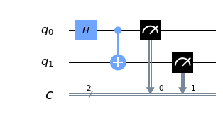

# Quantum

Welcome to quantum computer programming. There's no shortage of hype around quantum computing on the internet, but I am going to still outline the propositions made by quantum computing in general, as well as how this pertains to us and programmers who intend to work with quantum computers.

<h4><strong>Warning</strong></h4>

The subject matter of quantum physics in general is very advanced, complex, confusing, and complicated. I am not a quantum physics expert. Dare I suggest too, no one is a quantum physics expert, but there are people far more qualified than me to talk on the theories and physics side of things.

I will still outline some basics, but I highly encourage you to dive into the theory and conceptual side of quantum physics on your own because I really am not the best person to educate there. I am going to focus mainly on the programming and application side of things here.

That said, some basic foundation is required, so:

<h4><strong>What are quantum computers?</strong></h4>

Quantum computers are machines that work with qubits (quantum bits) rather than regular bits.

<h4><strong>What's a qubit?</strong></h4>

A regular bit is a transistor that registers either a high or low voltage, which corresponds to 1 or 0 respectively. Through advances in technology over the years, we have bits that are nearly the size of atoms, which is absolutely incredible.

A quantum bit is a 2-state quantum "device." Many things can be used as qubits, such as a photon's horizontal and vertical polarization, or the spin up or spin down of an electron. What this means for us as computer scientists is that a qubit can be a 0, 1, or both.

Because, qubits also have 2 other very important properties:
<ul>
    <li>Superposition - this is where a qubit is, while left unobserved, all of its possible states. Once observed, it will collapse into one of the possible states.</li>
    <li>Entanglement - This is where one qubit's state is linked to another. When entangled with each other, a change in one of the entangled qubits will change the other instanty. At any distance. Take that both of those words are fully intended. Instantly and *any* distance, which is what Einstein referred to as "Spooky action at a distance," since this appeared to violate various rules like transmitting information faster than the speed of light. This is referred to as quantum non-locality. I haven't personally seen a compelling explanation as to why this isn't spooky action at a distance, but we are assured by super smart people that it isn't... even though the behavior is as such at least with what we'll be doing. Still seems spooky to me.</li>
</ul>

You're going to be thinking that a lot, but these are the properties that make quantum computers very compelling to use for certain problems. Both superposition and entanglement seem like magic to me, but both are proven qualities of qubits.

<h4><strong>What problems are quantum computers for?</strong></h4>

Quantum computers wont be replacing classical computers. They're more likely to continue working alongside them, just as they are already doing today. As you will see, we tend use a classical computer to represent a quantum circuit to the quantum computer, the quantum computer runs some cycles on this circuit, and then reports back to us again with a classical bit response.

Quantum computers work very well for problems that exponentially explode.

Problems like logistics, such as the most ideal delivery route for trucks, or even concepts like planning for companies, where each choice branches out into new possible choices and opportunities.

This might still seem vague. Let's consider you're planning a charity dinner and you're attempting to seat people together who will keep eachother in good, donating, moods.

Let's pretend for now you just have 1 table with 5 seats. How many combinations do we have here? Well, it's 5x4x3x2x1, or 5 factorial, which is 120. This means there are 120 possible combinations.

What happens if we added... just one more seat? That'd be 6 factorial, which gives us 6x5-factorial, or 720. Just one more seat is 6x as many combinations.

What about 10 seats? That's 3,628,800 combinations. Modeling is probably the most near-term real-world example that I see quantum computers being useful.

Classical computers can barely simulate many single molecules...and they do a very poor job of it (due to the issue of how many possibilities there are given a situation). You currently cant rely on a classical computer to do chemistry simulations reliably.

A quantum computer can actually model many molecules already today reliably, and it only gets better from here seemingly.

<h4><strong>How do quantum computers consider, fundamentally, more possibilities at once?</strong></h4>

With classical computers:

`n_states = 2 x n_bits`

With quantum computers:

`n_states = 2^n_bits`

Being exponential like this gives us some phenomenal properties. This is why quantum computers can help us with heavy-optimization types of tasks, or just tasks that have many possibilities.

<h4><strong>Quantum computers are probability</strong></h4>

I think the simplest explanation of a quantum computer that I can come up with for now is that:

Classical computers can approximate and synthesize probability, they are not truly accurate and can *never* be with most tasks that use probability, unless of course you really can fit the entire range of possibilities into memory. Then you can get pretty close. But again, the probability space tends to explode as you add more variables.

Quantum computers do not model probability. They simply *are* the probability.

For this reason, quantum computers are also great for modeling things like molecules. With quantum computers, we could perform many chemistry experiments solely on quantum computers, which should significantly speed up many areas of research.

<h4><strong>Sold! I want a quantum computer</strong></h4>
You can't really buy a quantum computer yet, unless you build one yourself. As much as I can guess, a quantum computer would likely be somewhere between ten million dollars and one hundred million dollars, if not more, and require specialized personel and equipment to keep running. It appears that DWAVE has actually sold at least one &#36;15 million USD quantum computer.

I have to admit though, I am a bit confused on exactly what D-Wave's computers are as compared to what IBM and Google are working on. D-Wave's machines have seemingly been able to have x50 more qubits than everyone else. I see they use some different methods, and no one has seemingly been able to prove their machines are inferior yet. This will be interesting to see play out.

<h4><strong>But we *can* access quantum computers in the cloud!</strong></h4>

So these companies who have no doubt spent hundreds of millions of dollars on these quantum computers...what do they do with them? It turns out, opening them up to the public, for free, is not uncommon.

Google, Microsoft, IBM, D-Wave, and I am sure many others all offer some form of cloud-based quantum computer access.

Among them IBM's be the easiest to get up and running with. You really can go from nothing to running on an actual quantum computer in a few minutes for free.

But we're currently at a stage with Quantum computers where the technology exists but no one really knows what all we can do here, or what will come of it. So, let's take advantage of this absurd time and play with the bleeding edge of technology!

IBM has also done what I would call a phenomenal job with making both the tools as well as education available for free to anyone who is interested in diving in. I hope to continue this trend for them.

<h4><strong>Requisites:</strong></h4>

 - install python3

`pip install qiskit numpy jupyterlab matplotlib qiskit-ibmq-provider`

I personally found that I had to force install `qiskit-ibmq-provider`:

(on linux):
`sudo pip3.7 install --upgrade --force-reinstall qiskit-ibmq-provider`

# Let's get started!

Quantum computers essentially are different to their core, the "bit." Thus, as painful as it may be, we will be starting at the bit-level, the qubit. We quite literally will be building out the "circuits" for our bits, creating various types of gates.

The following circuit appears to me to be the "hello_world" quantum circuit of choice for everyone, so I'll stick with it.

```python
import qiskit as q
%matplotlib inline

circuit = q.QuantumCircuit(2,2)  # 2 qubits, 2 classical bits 
circuit.x(0)  # not gate, flips qubit 0.
circuit.cx(0, 1) #cnot, controlled not, Flips 2nd qubit's value if first qubit is 1
circuit.measure([0,1], [0,1])  # ([qbitregister], [classicalbitregister]) Measure qubit 0 and 1 to classical bits 0 and 1
```

<qiskit.circuit.instructionset.InstructionSet at 0x7ff3b0bf4290>

```python
circuit.draw()  # text-based visualization. (pretty cool ...actually! Nice job whoever did this.)
```

```python
        ┌───┐     ┌─┐   
q_0: |0>┤ X ├──■──┤M├───
        └───┘┌─┴─┐└╥┘┌─┐
q_1: |0>─────┤ X ├─╫─┤M├
             └───┘ ║ └╥┘
 c_0: 0 ═══════════╩══╬═
                      ║ 
 c_1: 0 ══════════════╩═
```

```python
circuit.draw(output="mpl")  # matplotlib-based visualization.
```

### output 1


Alright, we've built our quantum circuit. Time to run the circuit. So let's go ahead and just get running something on a Quantum Computer out of the way.

Head to <strong><a href="https://quantum-computing.ibm.com/" target="blank">quantum-computing.ibm.com</a></strong>, create an account, and then you can click on the account icon at the top right (at least at the time of my writing this), then choose "my account"

From there, you can click "copy token" which will copy your token to clipboard, which we will use in a moment:

### Token screen


Once you've got your token, you're ready to try to connect to a quantum computer and run there. Now you can connect with your token by doing:

```py
from qiskit import IBMQ

IBMQ.save_account('API TOKEN HERE!', overwrite=True)
IBMQ.load_account()
```

But for me I put my api token in my system environment variable, then I use os module to grab it. Don't be confuse with the `IBMQ_API` is an environment variable of my system which I gave a value of my IBMQ api token key. This is the most secure way, because sometimes once you finish, and about to push to repository, you might forgot to delete the token while pushing it in your repository, my recommendation is this (below one) instead of that (above one).

```py
import os
api_token_key = os.environ.get('IBMQ_API') # OR
# api_token_key = os.getenv('IBMQ_API')

from qiskit import IBMQ
IBMQ.save_account(api_token_key, overwrite=True)
IBMQ.load_account()
```

<AccountProvider for IBMQ(hub='ibm-q', group='open', project='main')>

```python
IBMQ.providers()
```

[<AccountProvider for IBMQ(hub='ibm-q', group='open', project='main')>]

```python
provider = IBMQ.get_provider('ibm-q')
for backend in provider.backends():
    try:
        qubit_count = len(backend.properties().qubits)
    except:
        qubit_count = "simulated"
    print(f"{backend.name()} has {backend.status().pending_jobs} queued and {qubit_count} qubits")
```

```py
ibmq_qasm_simulator has 1 queued and simulated qubits
ibmq_lima has 28 queued and 5 qubits
ibmq_belem has 31 queued and 5 qubits
ibmq_quito has 285 queued and 5 qubits
simulator_statevector has 1 queued and simulated qubits
simulator_mps has 1 queued and simulated qubits
simulator_extended_stabilizer has 1 queued and simulated qubits
simulator_stabilizer has 1 queued and simulated qubits
ibmq_manila has 116 queued and 5 qubits
ibm_nairobi has 31 queued and 7 qubits
ibm_oslo has 27 queued and 7 qubits
```

```py
from qiskit.tools.monitor import job_monitor

backend = provider.get_backend("ibm_nairobi")
job = q.execute(circuit, backend=backend, shots=500)
job_monitor(job)
```

Job Status: job is queued (3)

```py
from qiskit.visualization import plot_histogram
from matplotlib import style

style.use("dark_background") # if using dark mode on jupyter notebook, so I use this to see the chart.

result = job.result()
counts = result.get_counts(circuit)

plot_histogram([counts], legend=['Device'])
```

### output 2


So mostly we got 11 at the end of our test (each number corresponds to a bit value here), which was expected. Our default qubit value is 0, then we used a not gate (`.x`), which then made it a one. Then we applied an exclusive or, which would flip the 2nd (target qubit), if the first (the control qubit), was a 1. It was, so this is why our intended answer was indeed a 11. As you can see, however, we got some 01, 10, and some 00. What's this?

This is noise. Expect noise, and rely on probability.

This is why we perform many "shots." Depending on the probability distribution possible for your output, you will want to perform a relevant number of "shots" to get the right answer.

Now, let's update this slightly. This is a *pretty* boring circuit.

```python
circuit = q.QuantumCircuit(2,2)  # 2 qbits, 2 classical bits.
circuit.h(0) # Hadamard gate, puts qubit 0 into superposition
circuit.cx(0, 1) #cnot, controlled not, Flips 2nd qubit's value if first qubit is 1
circuit.measure([0,1], [0,1])  # ([qbitregister], [classicalbitregister]) Measure qubit 0 and 1 to classical bits 0 and 1
```

<qiskit.circuit.instructionset.InstructionSet at 0x7ff3b0429310>

```py
circuit.draw(output="mpl")
```

### output 3


```py
backend = provider.get_backend("ibm_nairobi")
job = q.execute(circuit, backend=backend, shots=500)
job_monitor(job)
```

Job Status: job has successfully run

```py
result = job.result()
counts = result.get_counts(circuit)
plot_histogram([counts], legend=['Device'])
```

### output 4


Notice now that we get mostly 00 and 11 as results. There's some 01 and 10 as noise, but we see what we expect. Recall the `controlled not` gate will flip the target qubit (2nd one) if the control qubit (the first) is 1.

The 2nd qubit was 0 since it was never turned on, and the 1st qubit (qubit 0) was in superposition. Superposition means the qubit is in any of the possible states, but will collapse upon a single state when observed.

This is why we make many observations, so that we can see the actual distribution of outcomes.

Thus, we see close to a 50/50 split between 00 and 11 with this circuit. There's obviously noise too, but, in an ideal quantum computer, we'd only see 00 and 11.

As awesome as it really is to run on a quantum computer, it's fairly silly for us to just tinker around on a real quantum computer. Instead, we want to do most of our research and development work on a quantum simulator.

This saves us time (not waiting in a queue) along with getting out of the way for other people who have done their R&D locally and are now ready to test on the real thing.

To do R&D locally, it's quite simple. Rather than using an actual backend, we use a simulator. We could also use the simulator backend that IBM hosts.

```py
from qiskit import Aer  # simulator framework from qiskit

# will create a statevector of possibilities. 
sim_backend = Aer.get_backend('qasm_simulator')
```

```py
for backend in Aer.backends():
    print(backend)
```

```py
qasm_simulator
statevector_simulator
unitary_simulator
```

From: https://quantum-computing.ibm.com/jupyter/tutorial/advanced/aer/1_aer_provider.ipynb

- QasmSimulator: Allows ideal and noisy multi-shot execution of qiskit circuits and returns counts or memory
- StatevectorSimulator: Allows ideal single-shot execution of qiskit circuits and returns the final statevector of the simulator after application
- UnitarySimulator: Allows ideal single-shot execution of qiskit circuits and returns the final unitary matrix of the circuit itself. Note that the circuit cannot contain measure or reset operations for this backend

We'll use the `qasm_simulator`, since this most closely matches what we did above.

That said, when using simulators, we can use the unitary simulator if we would rather get something more like a matrix output. A statevector simulator will return a statevector. The Qasm sim returns the counts that we've seen so far.

Different outputs allow us different visualizations.

```py
job = q.execute(circuit, backend=sim_backend, shots=500)
job_monitor(job)
```

Job Status: job has successfully run

```py
result = job.result()
counts = result.get_counts(circuit)

plot_histogram([counts], legend=['Device'])
```

### output 5


Notice we didn't get a perfect 50/50, but there was no 01 or 10. Why not? Well, the "simulator" simulates a *perfect* quantum machine. One day, we may reach a perfect quantum machine. For now, perfect quantum machines only exist in the sim.

Anyway, now you can try tinkering about in the simulator, then you can test your results for real on an actual quantum computer when you're ready. I think that's enough for now! More to come in the future. More resources:

- Qiskit textbook: https://community.qiskit.org/textbook/
- Getting started with qiskit: https://qiskit.org/documentation/getting_started.html
- Qiskit wikipedia: https://en.wikipedia.org/wiki/Qiskit
- Useful notebooks https://quantum-computing.ibm.com/jupyter 
